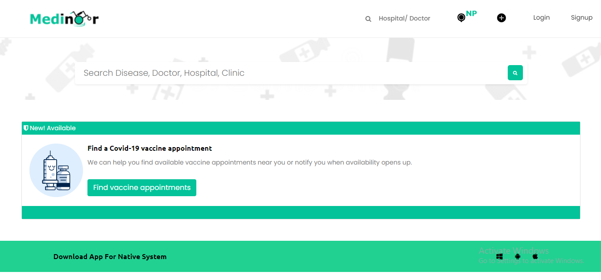
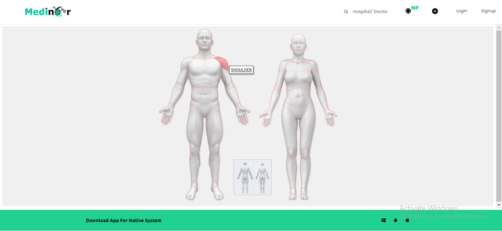
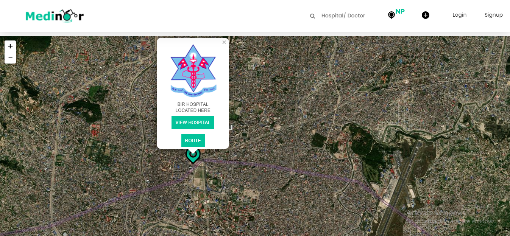

 
#  

 Effective app for medical sector and this was a challenge for myself to complete a webapp in 25 days. With working Twillo SMS system for the server to send sms to an ambulance winthin 3km radius during an emergency sent by medinoor app.
 
# Video Demo
https://user-images.githubusercontent.com/29134272/129065754-72d14365-637d-49ff-9ede-b21a750c0b57.mp4

# Main Page
 

# Search using body parts Page
 

# search using location
 
